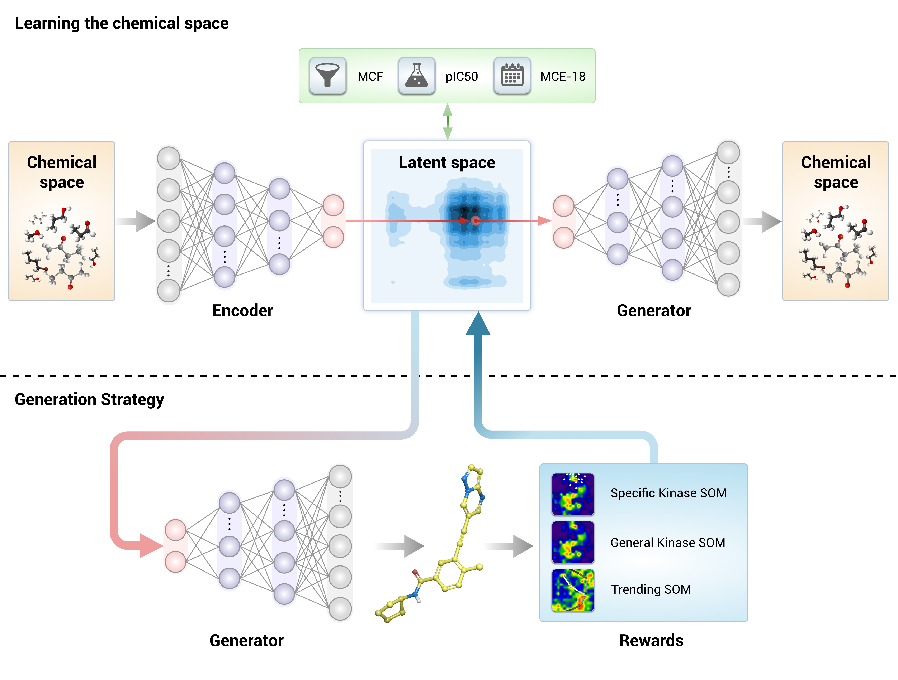

## Setup

### Using docker file
```
docker build .
```
### With Docker hub
```
docker pull docker.io/animesh1977/gentrl
```
### Manual
[Anaconda](https://docs.anaconda.com/anaconda/install/linux/)
```
apt-get install python3 libgl1-mesa-glx libegl1-mesa libxrandr2 libxrandr2 libxss1 libxcursor1 libxcomposite1 libasound2 libxi6 libxtst6
wget https://repo.anaconda.com/archive/Anaconda3-2019.10-Linux-x86_64.sh
```
[RD kit](https://www.rdkit.org/docs/Install.html)
```
conda create -c rdkit -n my-rdkit-env rdkit
conda activate my-rdkit-env
pip install sklearn jupyterlab
```
## Test

### through console
```
python3 trainGENTLR4HDACi.py
```
### through console
```
jupyter notebook --no-browser
```
Check out [pretrain.ipynb](./examples/pretrain.ipynb)

## Supporting Information for the paper _"[Deep learning enables rapid identification of potent DDR1 kinase inhibitors](https://www.nature.com/articles/s41587-019-0224-x)"_.

## Generative Tensorial Reinforcement Learning (GENTRL)
Supporting Information for the paper _"[Deep learning enables rapid identification of potent DDR1 kinase inhibitors](https://www.nature.com/articles/s41587-019-0224-x)"_.

The GENTRL model is a variational autoencoder with a rich prior distribution of the latent space. We used tensor decompositions to encode the relations between molecular structures and their properties and to learn on data with missing values. We train the model in two steps. First, we learn a mapping of a chemical space on the latent manifold by maximizing the evidence lower bound. We then freeze all the parameters except for the learnable prior and explore the chemical space to find molecules with a high reward.




## Repository
In this repository, we provide an implementation of a GENTRL model with an example trained on a [MOSES](https://github.com/molecularsets/moses) dataset.

To run the training procedure,
1. [Install RDKit](https://www.rdkit.org/docs/Install.html) to process molecules
2. Install GENTRL model: `python setup.py install`
3. Install MOSES from the [repository](https://github.com/molecularsets/moses)
4. Run the [pretrain.ipynb](./examples/pretrain.ipynb) to train an autoencoder
5. Run the [train_rl.ipynb](./examples/train_rl.ipynb) to optimize a reward function
